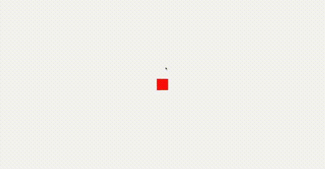

# Three JS Projects
<a><h2>3D Model Color Customizer App</h1>Click here </a>to design your own chair

Fully customizable with complex textures like wood, metal, silk etc

 
 

#

<h2>Shootout (Not ready for production)</h2>Play an in-browser shooting game

 

#

<a><h2>Flappy Plane</h1>Click here </a>to play an in-browser game inspired by flappy birds

 

#

<a><h2>Sparkling Waves</h1>Click here </a>to check out basically the landing page of my website

 
 

#

<a><h2>Feel The Sphere</h1>Click here </a>to play with an awesome looking metalic ball :P

 
 

#

<h2>Steps to Run the project</h2>

-   Run `npm install` in terminal to install the dependecies
-   Run `npm run dev` in terminal to start running the application

 
 

<h2> Hey there! I'm Rishab Lamba.</h2>

<h2> 👨🏻‍💻 About Me </h2>

-   🔭 &nbsp; I’m a FullStack Developer with proficiency in the MERN(Mongo DB|Express|React|Node) stack and <strong>3D UI development</strong>
-   🌱 &nbsp; Enthusiast in Data Science and Artificial Intelligence .
-   🎓 &nbsp; Pursuing my Masters in Computer Science from University of Illinois at Chicago.
-   🤔 &nbsp; Exploring new technologies and developing software solutions and quick hacks.
-   💼 &nbsp; Software Engineer.
-   ☕ &nbsp; I belive, a perfect cup of coffee can be the ultimate solution for any stress.

<h3>🛠 Tech Stack</h3>

-   💻 &nbsp; JavaScript | Python | ReactJS | NodeJS | Express | Three JS
-   🌐 &nbsp; React Native | HTML | CSS | JavaScript | Bootstrap
-   🛢 &nbsp; Mongo DB | MySQL | Firebase
-   🔧 &nbsp; Visual Studio code | Git

 